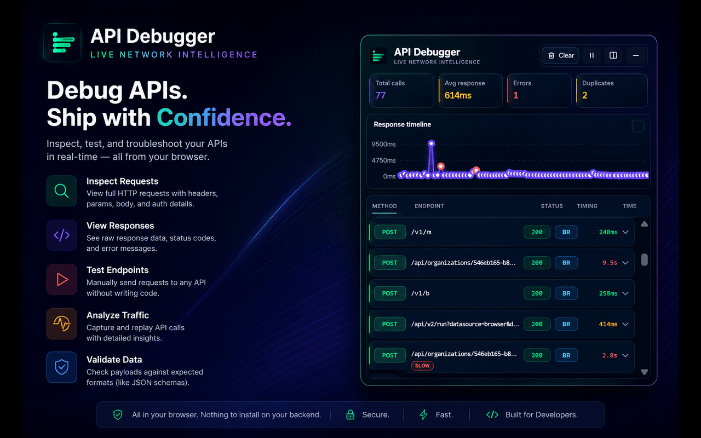
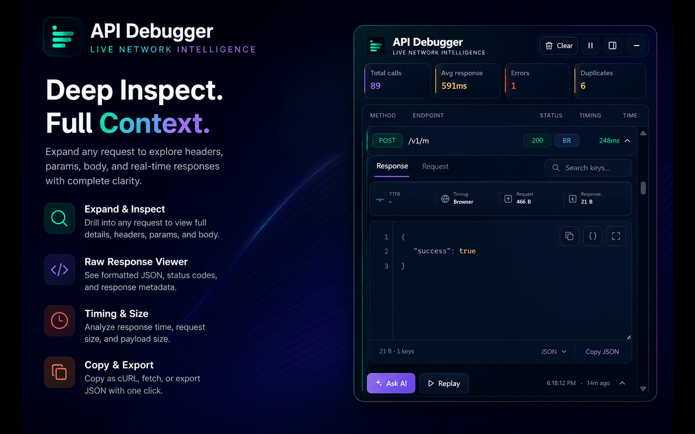

# API Debugger Overlay

API Debugger Overlay is a Chrome Manifest V3 extension that captures `fetch` and `XMLHttpRequest` traffic from the current page and shows a live in-page debugging overlay.

It is designed for frontend engineers, fullstack developers, and QA engineers who want quick API visibility without keeping DevTools open all the time.

## Screenshots

### Live Traffic Overview



### Request And Response Inspector



## Why Use It

- See API traffic directly on the page you are debugging
- Inspect request and response bodies, timing, duplicates, and dependency chains
- Replay captured requests in the original tab context
- Get optional AI suggestions for slow or failing requests

## Requirements

- Node.js 20+
- pnpm
- Chrome 114+ for `chrome.sidePanel`

## Setup

Install dependencies:

```bash
pnpm install
```

Start development:

```bash
pnpm dev
```

Create a production build:

```bash
pnpm build
```

## Common Commands

```bash
pnpm lint
pnpm test --run
pnpm test:e2e
pnpm package:extension
```

## Load In Chrome

1. Run `pnpm build`.
2. Open `chrome://extensions`.
3. Enable **Developer mode**.
4. Click **Load unpacked**.
5. Select the generated `dist` directory.

## Documentation

- [Features](docs/features.md)
- [Contributing](CONTRIBUTING.md)
- [Chrome Web Store release guide](docs/chrome-web-store-release.md)
- [Chrome Web Store listing copy](docs/chrome-web-store-listing.md)
- [Privacy policy](docs/privacy-policy.md)

## License

MIT. See [LICENSE](LICENSE).
